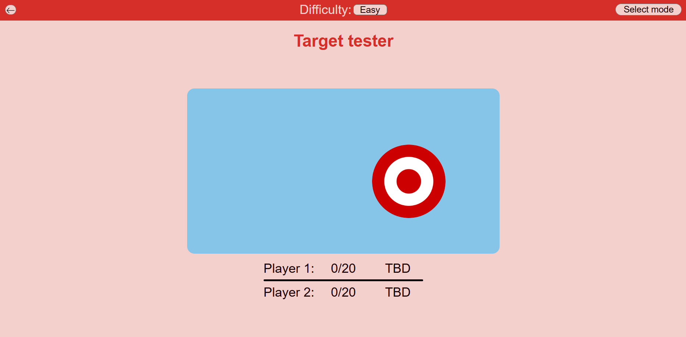
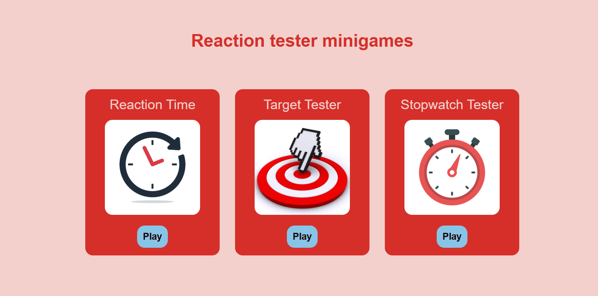
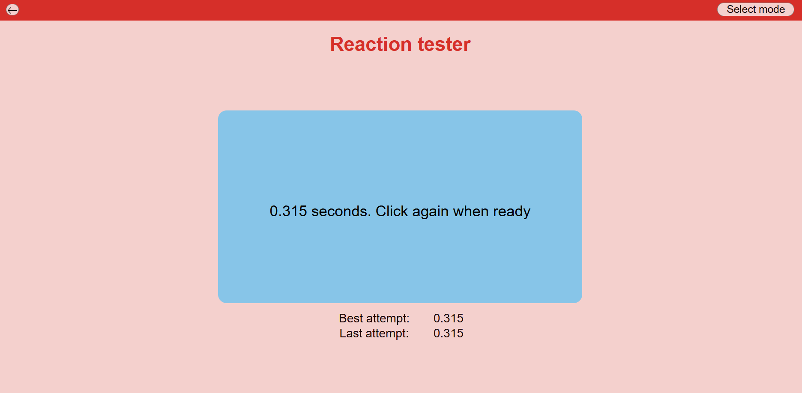
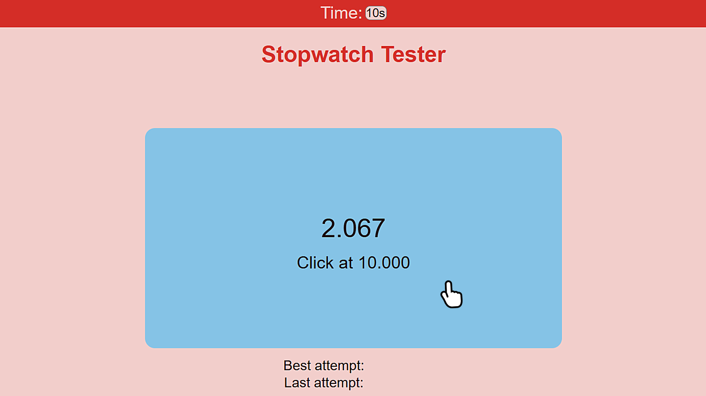

# reaction-tester
A web application that tests your reaction time through various minigames



You can try this webpage for yourself [here](https://pampu-rares.github.io/reaction-tester/).

## Getting Started

### Installation

1. Paste this line into your terminal:

```shell
git  clone  https://github.com/Pampu-Rares/reaction-tester.git
```

2. You can now host the project locally

## Usage

### Main Page

The main page displays a list of all of the available minigames. Currently, there are two of them.
- A third minigame will be added soon🔜
- Each mode offers the option for both 1-player and 2-player



### Target Tester Minigame

This minigame tests your ability to shoot a number 20 targets as fast as you can.

- ⭐It has three difficulties: Easy, Medium and Hard
Choose the desired one or challenge yourself by making the target smaller


### Reaction Time Minigame

This is the best and most straightforward way to test your reaction time.
All you have to do is click in the blue rectangle and follow the written instructions.

- 💡Pro tip: You can also press the Spacebar instead of clicking the blue area



### Stopwatch Tester Minigame

This minigame challenges your internal clock. Select a time interval and, after 5 seconds, the on-screen timer disappears. Click stop when you think the time is up. 

- 💡Pro tip: You can also press the Spacebar instead of clicking the blue area
- ⌚You can select between 10, 15 and 20 seconds



## License

Distributed under the MIT License. See `LICENSE` for more information

## Contact
For improvements or suggestions you can contact me here:
Pampu Rares - [rarespampu@gmail.com](mailto:rarespampu@gmail.com)